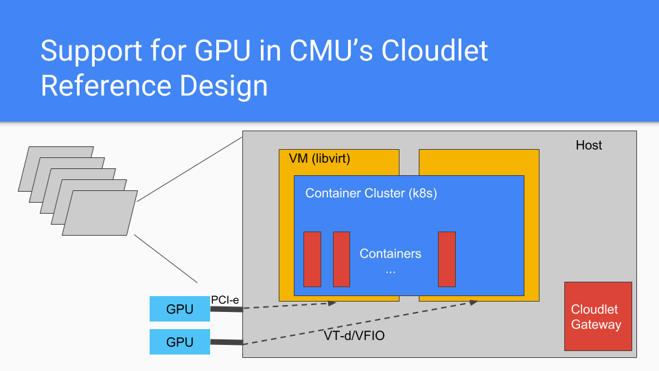

# GPU Passthrough Setup and Performance

Many edge workloads require a GPU to meet latency requirements. However, sharing
and virtualizing GPU devices for computation remain a challenge. In below, I
will describe our group's setup to allow multi-tenancy on GPUs.

## Architecture

The figure below represents the architecture. We adopt a containers on top of
virtual machines approach to allow GPU sharing. The GPU device is dedicated to a
particular VM through GPU-passthrough on the host.



## Setup

### GPU-Passthrough to a libvirt VM

The setup process is automated through Ansible. Please see [repo](https://github.com/junjuew/ansible-dotfiles/). 
Use following command to set up GPU passthrough.

```bash
ansible-playbook -i hosts-gpu-passthrough gpu-passthrough-playbook.yml
```

### Container Access to GPU

nvidia-docker enables containers to access GPU easily. See [repo](https://github.com/junjuew/ansible-dotfiles/) for installation.

## Performance Overhead

**In all of our benchmark measurements, the overheads introduced by virtualization are between 0% and 2.3%.**

We used two benchmarks to measure the overhead introduced by VM and container virtuation. The first benchmark [DeepBench](https://github.com/baidu-research/DeepBench) is compute-intensive. In particular, we focused on convolution operation --- the core workload of convolutional neural networks. The second benchmark [BandwidthTest](https://github.com/parallel-forall/code-samples/blob/master/series/cuda-cpp/optimize-data-transfers/bandwidthtest.cu) evaluates the data transfer bandwidth between the host and the GPU.

### HW & SW Setup

The GPU in test is NVIDIA Tesla GTX 1080 Ti GPU.

* Max GPU Clock: 1911 MHz(Graphics), 5505 MHz(Memory)
* Default Computing mode

The software in bare-metal, VM, and container-inside-VM is kept the same.

* Ubuntu 16.04
* linux kernel 4.4.0-130
* 396.37 NVIDIA driver + cuda 9.0 + cudnn 7.1.4.18

The VM is created using qemu-kvm 2.6.2 and libvirt. GPU passthrough is achieved through vfio.
The container-inside-VM is created using nvidia-docker 2.0.3 and docker 18.03.1.

### Convolution Kernels --- Compute

We used floating point general matrix multiplication from [this
benchmark](https://github.com/baidu-research/DeepBench). The benchmark is
invoked with

```bash
./conv_bench inferenct float
```

The benchmark uses *cudnnFindConvolutionForwardAlgorithm* in cudnn to determine the convolution algorithm to use at runtime. In our experiments, such dynamic algorithm selection results in large variance of execution time as different algorithms are used across different runs. It is unclear why cudnn would select different algorithms even when convolution parameters are kept the same. To obtain reproducible results, we manuallly fixed the convolutional algorithm to be CUDNN_CONVOLUTION_FWD_ALGO_IMPLICIT_PRECOMP_GEMM in the code. See [here](https://docs.nvidia.com/deeplearning/sdk/cudnn-developer-guide/index.html#api-introduction) for more on what the algorithm does.

We used the same convolutional kernels as described in [DeepBench](https://github.com/baidu-research/DeepBench) "Server Inference Setup" for comparison.

#### Convolution Experiment Parameters

| Experiment | Input Size    | Filter Size   | # of Filters | Padding (h, w) | Stride (h, w) |
|----------------|--------------------------------|---------------|--------------|----------------|---------------|
| 1 | W = 341, H = 79, C = 32, N = 4 | R = 5, S = 10 | 32           | 0,0            | 2,2           |
| 2 | W = 224, H = 224, C = 3, N = 1 | R = 7, S = 7  | 64           | 3, 3           | 2, 2          |
| 3 | W = 56, H = 56, C = 256, N = 1 | R = 1, S = 1  | 128        | 0, 0           | 2, 2        |
| 4 | W = 7, H = 7,  C = 512, N = 2  | R = 1, S = 1  | 2048         | 0, 0           | 1, 1          |

#### Convolution Speed
| Virtualization |   Exp 1 (us)          | Exp 2 (us)   | Exp 3 (us)  | Exp 4 (us)    |
|:--------------:|:---------------------:|:------------:|:-------------:|:------------:|
| bare-metal     |  381 +- 9 | 44 +- 1 | 39 +- 1 | 68 +- 1 |
| VM             |  384 +- 11 | 45 +- 1 | 39 +- 1 | 67 +- 1 |
| Container inside VM |  386 +- 9 | 45 +- 1 | 39 +- 1 | 68 +- 2 |

<!---
#### GEMM Benchmark Speed

GEMM benchmark is only executed for 3 times. The running time is not big enough to reflect average case.

| Virtualization |   5124x700x2048 (ms)      | 35x700x2048 (ms) | 3072x3000x1024 (ms) | 512x6000x2816 (ms) |
|:--------------:|:---------------------:|:------------:|:-------------:|:------------:|
| bare-metal     |   1.75 +- 0.03        | 0.03 +- 0.00 | 3.14 +- 1.75 | 1.90 +- 0.09 |
| VM             |    1.73 +- 0.04       | 0.03 +- 0.00 | 2.33 +- 0.59 | 2.16 +- 0.48 |
| Container inside VM | 1.76 +- 0.02     | 0.04 +- 0.00 | 2.83 +- 1.10 | 2.94 +- 0.82 |
--->

### Bandwidth Test --- Bandwidth

We benchmarked memory bandwidth between the host and the GPU device using
[bandwidthtest.cu](https://github.com/parallel-forall/code-samples/blob/master/series/cuda-cpp/optimize-data-transfers/bandwidthtest.cu).
You can learn more about pinned transfer bandwdith
[here](https://devblogs.nvidia.com/how-optimize-data-transfers-cuda-cc/). 

#### Pinned Transfer Bandwidth

| Virtualization |   Host To Device Bandwidth (GB/s)      | Device to Host Bandwidth (GB/s)    |
|:--------------:|:--------------------------------------:|:----------------------------------:|
| bare-metal     | 6.17 +- 0.00                           |  6.67 +- 0.01                      |
| VM             |    6.13 +- 0.00                        | 6.66 +- 0.00                       |
| Container inside VM | 6.12 +- 0.02                      | 6.58 +- 0.02                       |

<!---
#### Tensorflow Benchmarks:

* Tensorflow Version: 1.9.0
* python3
* Batch Size: 1
* 300 random generated examples, 3 runs.
* [Benchmark script](https://gist.github.com/junjuew/82d3b0d513e3debd2d453ee07505d32e)

| Virtualizaton |   SSD MobileNet V1 (ms)      | SSD Inception V2 (ms)    | Faster-RCNN Inception V2 (ms) | Faster-RCNN ResNet101 (ms)  |
|:-------------:|:----------------------------:|:------------------------:|:-----------------------------:|:---------------------------:|
| bare-metal | 119  +- 5     | 130 +- 7 | 180 +- 6 | 220 +- 5 |
| container inside a VM with GPU passthrough | 108  +- 19     | 114 +- 20 | 168 +- 22 | 225 +- 18 |
| VM with GPU passthrough (gpu exclusive-process mode) | 118  +- 27     | 128 +- 23 | 175 +- 22 | 225 +- 19 |
| VM with GPU passthrough (gpu default mode) | 108  +- 18     | 119 +- 19 | 164 +- 19 | 226 +- 17 |

Results on cloudlet001 with Tesla K40c
The clock is set to max clock speed: 875MHz(Graphics),3004MHz(Memory)
Software stack should be similar to above.

| Virtualizaton |   SSD MobileNet V1 (ms)      | SSD Inception V2 (ms)    | Faster-RCNN Inception V2 (ms) | Faster-RCNN ResNet101 (ms)  |
|:-------------:|:----------------------------:|:------------------------:|:-----------------------------:|:---------------------------:|
| bare-metal | 117, std 5      | 134, std 4 | 233, std 6 | 428, std 4 |
| container inside a VM with GPU passthrough | 104, std 20     | 128, std 16 | 227, std 16 | 412, std 13 |

# Second-Round Of Test
| Virtualizaton |   SSD MobileNet V1 (ms)      | SSD Inception V2 (ms)    | Faster-RCNN Inception V2 (ms) | Faster-RCNN ResNet101 (ms)  |
|:-------------:|:----------------------------:|:------------------------:|:-----------------------------:|:---------------------------:|
| bare-metal |      |  |  |  |
| VM with GPU passthrough (gpu default mode) | 95 +- 13  | 101 +- 13 |  | |
| container inside a VM with GPU passthrough |    |  | |  |
-->

### Experiments Data

Complete experiment results are in [data](data) directory.

* baremetal-conv, vm-conv, container-conv: Convolution kernel benchmark results for bare-metal, vm, and container-inside-VM.
* run.sh: Convolution kernel result summary script
* bandwidth-test: BandwithTest benchmark results for bare-metal, vm, and container-inside-VM.
* conv-dynamic-algorithm: Unmodified convolution kernel benchmark results, which select convolution algorithms at runtime.
* gemm-test: GEMM kernel benchmark results using DeepBench. Note that the data has high variance since not enough runs are executed.
* vm-ssd-*: Object detection benchmark results on VM using [cvutils](www.github.com/junjuew/cvutils). Note that this benchmark includes extra processing time on CPU as well. It should not be used for measuring virtualization overhead.
